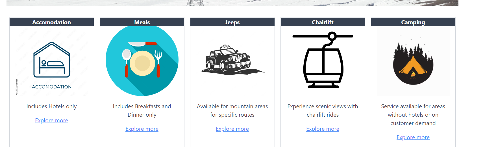
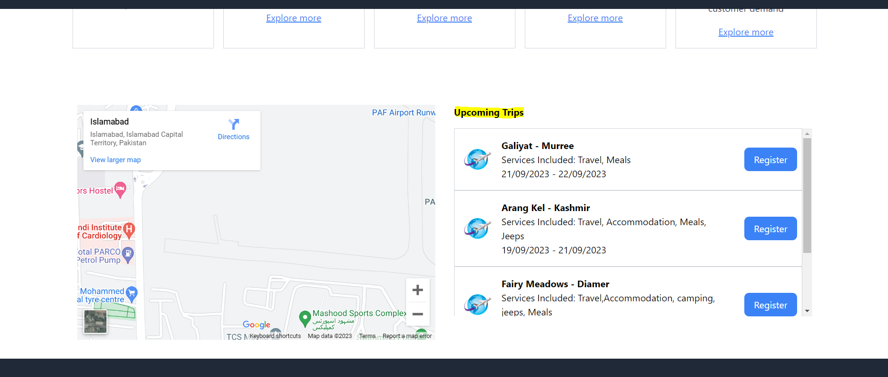

This assignment covers following:

ORM (Prisma) setup

Database (Supabase) setup

Redux setup for state management

Fetch & Dispaly Dynamic data (Services section and upcoming lists are dynamic)

Login/Sign up isn't functional in this module as not required

Note: While testing if prisma connection fails, please let me know so I can restat it on supabase.

http://localhost:3000/home
